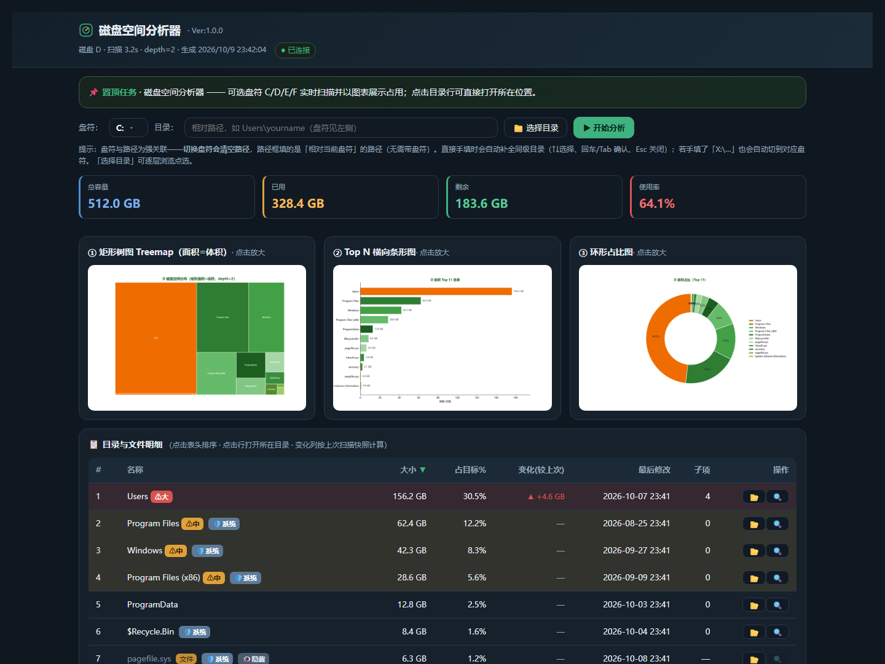

# 雪人老师·磁盘空间分析器

交互式磁盘空间分析工具：给定磁盘（C/D/E/F 任选、多选或全盘）或任意目录，把「空间被谁吃掉」用图表讲清楚。纯 Python，零 CDN，离线可用。

> 图示：虚拟数据截图，展示「总容量 512 GB / 已用 328.4 GB / 剩余 183.6 GB / 使用率 64.1%」四项概览卡片、Treemap + Top N 条形图 + 环形占比图三张可视化、以及可排序的目录/文件明细表（含 🛡️系统、👁️隐藏 属性标签与 🔥快增 变化标记）。



## 两种用法

### 1. 命令行静态报告（一次性 HTML）

```bash
# 分析 E 盘，输出自包含 HTML 报告
python scripts/disk_analyzer.py --disk E --depth 2 --top 15 --out disk_report_E.html

# 同时分析 C、E 两盘（仅顶层）
python scripts/disk_analyzer.py --disk C E --depth 1

# 分析全盘
python scripts/disk_analyzer.py --disk all --top 20

# 分析单个目录
python scripts/disk_analyzer.py --dir "D:\Projects" --out report.html
```

报告含：容量概览卡片 + 三张图（①矩形树图 Treemap，面积=体积 ②Top N 横向条形图 ③环形占比图）+ 可点击表头排序的明细表。

### 2. 网页交互版（推荐，可切换/可停止/可点开目录）

```bash
python scripts/disk_analyzer_web.py --port 8780
```

浏览器打开 `http://127.0.0.1:8780/`，你会看到：

- **盘符下拉**（C/D/E/F）+ **📁 选择目录**（系统对话框选文件夹，自动拼绝对路径）
- **▶ 开始分析**：点击后才扫描（不自动扫）
- **实时进度卡片**：旋转图标 + 进度条（百分比 + 流动光带）+ `📍 当前：<正在扫描的目录>` + 耗时/完成项；扫完显示「✅ 扫描完成」
- **⏹ 停止**：随时中断扫描，返回已扫到的部分结果
- **📋 明细表**：点表头排序；点目录行 / 行尾 📂 直接打开所在位置
- **路径太长**：中间省略号单行显示（如 `E:\工作资料\季度汇报材料…最终版.mp4`），悬停看完整路径

## 最近更新（v1.0.1 · 2026-10-09）

**网页交互版 4 项 UX / 口径修正：**

1. **占比口径更准确** —— 表头「占磁盘%」→「**占目标%**」（`title` 悬浮说明：占当前扫描目标 = 所选盘符 / 文件夹），扫描单个文件夹时不再让人误以为分母是整盘容量。表格 / 树形 / 图例 / 说明块四处文案同步。
2. **文件行按钮布局统一** —— 🔍 扫描图标对文件行**不再隐藏**，改为禁用态（`opacity:.28`、灰置、`title="文件无法展开子项"`），所有行按钮位置一致，列表纵向不再抖动。
3. **属性标签双独立** —— 内核新增 `is_hidden_attr()`（用 `GetFileAttributesW` 读 `FILE_ATTRIBUTE_HIDDEN`），与原有 `is_protected()` 独立判定，文件行可**同时**挂 🛡️系统 + 👁️隐藏；`pagefile.sys` / `$Recycle.Bin` 等 Windows 隐藏条目自动打 👁️ 标签，隐藏条目名统一灰色显示。目录行仍按"系统优先"只挂一个标签以保持简洁。
4. **盘符下拉自绘** —— 原 `<select>` 原生弹层与页面深色主题冲突，改为自绘下拉（`.ddlist` + `mountDD()`），原生 `<select>` 保留为隐藏值源维持兼容；视觉与整体风格统一。

## 依赖

- Python 3（本机 managed python 已装）
- `matplotlib`、`squarify`：缺失则 `pip install matplotlib squarify`
- Windows：自动使用微软雅黑，图表中文不乱码

## 服务生命周期与断连处理

网页交互版依赖本地 HTTP 服务（`disk_analyzer_web.py`）。请注意：

- **启动**：运行上面的 `python scripts/disk_analyzer_web.py --port 8780`，服务才在 `http://127.0.0.1:8780/` 提供页面与扫描。
- **关闭后页面会失效**：服务一停，页面（及所有扫描）都由它托管，自然打不开、「开始」也无反应。这不是 bug，而是本地服务架构使然。
- **断连自愈提示**：页面现在会**实时检测服务连接**（顶部「● 已连接 / ● 未连接」）。一旦检测到服务断开，会弹出红色「🔴 服务未连接」横幅，内含**一键复制启动命令**按钮；此时点「开始分析」会明确提示「先启动服务」，不再静默卡死。
- **恢复**：在终端重新运行启动命令（端口一致），然后**刷新页面**即可。

> 想让它常驻？可把它注册为开机启动 / 计划任务（需本机管理员权限），或每次用到时让助手帮你启动并打开预览。

## 说明

- **只读工具**：只统计体积，**不删除/移动任何文件**；清理建议请确认后再执行。
- 跨盘对比时，对每个盘各跑一次即可。
